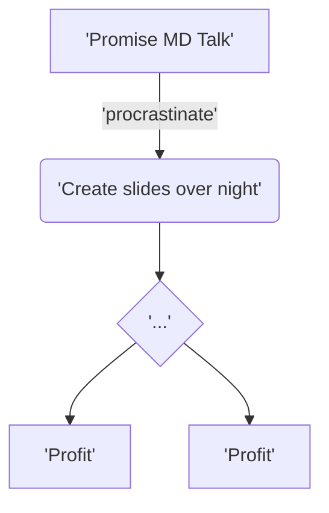
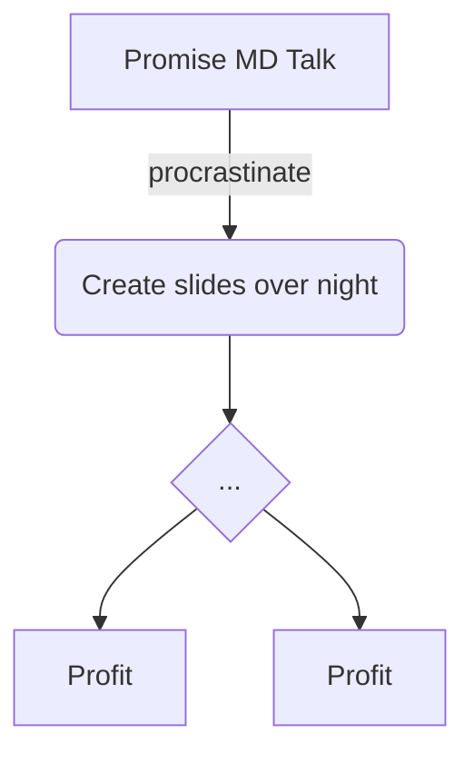
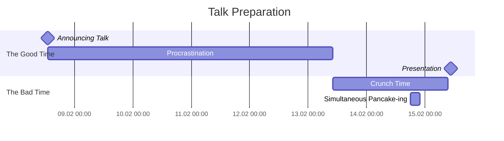

# [Mermaid](https://mermaid.js.org/) Diagrams

- [Mermaid Live Editor](https://mermaid.live)

---
````

```mermaid
flowchart TD
   A['Promise MD Talk'] -->|'procrastinate'| B('Create slides over night')
   B --> C{'...'}
   C --> D['Profit']
   C --> E['Profit']
```
````


```mermaid
flowchart TD
   A[Promise MD Talk] -->|procrastinate| B(Create slides over night)
   B --> C{...}
   C --> D[Profit]
   C --> E[Profit]
```
---

````

```mermaid
gantt
   title Talk Preparation
   dateFormat MM-DDTHH:mm
   axisFormat %d.%m %H:%M
   tickInterval 1day
   
   section The Good Time
   Announcing Talk: milestone, m1, 02-08T13:00, 5m
   Procrastination: t1, after m1, 02-13T10:00
   Presentation: milestone, m2, 02-15T10:30, 02-15T10:45
   
   section The Bad Time
   Crunch Time:t2, after t1, 02-15T09:30
   Simultaneous Pancake-ing: t4, 02-14T18:00, 02-14T22:00
```
````


```mermaid
gantt
   title Talk Preparation
   dateFormat MM-DDTHH:mm
   axisFormat %d.%m %H:%M
   tickInterval 1day
   
   section The Good Time
   Announcing Talk: milestone, m1, 02-08T13:00, 5m
   Procrastination: t1, after m1, 02-13T10:00
   Presentation: milestone, m2, 02-15T10:30, 02-15T10:45

   section The Bad Time
   Crunch Time:t2, after t1, 02-15T09:30
   Simultaneous Pancake-ing: t4, 02-14T18:00, 02-14T22:00
```
