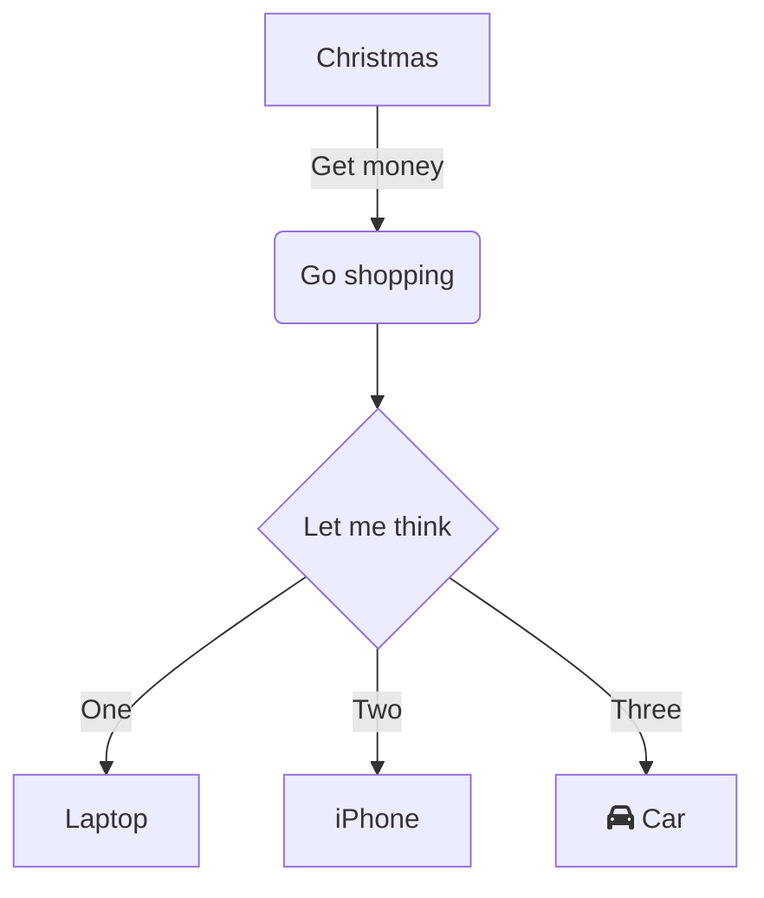

<!--
pandoc `
--from=markdown+backtick_code_blocks+fenced_code_attributes+fenced_divs+tex_math_dollars+footnotes `
-t revealjs `
-s 'notes.md' -o 'slides.html' `
--embed-resources --standalone
-->

# All the Markdown Stuff we know already

## General Markdown Stuff - 
- Chapter links
- emotes (gitmoji.dev)
- Math fomulas
   - `$...$` or ``` $`...`$ ``` for inline math
   - `$$ ... $$` or ```` ```math ... ``` ```` for blocks
- diffs ```` ```diff ````
- footnote Links `[^1]` with `[^1]: Footnote text`

## Stuff for GitHub & GitLab (Issues) {style="background: rgba(0,0,0,0.8); padding: 15px; border-radius: 15px;"}
- Task List + issues
   - GitLab supports `[~]` for strikethru
   - add `+` to end of issue ref to expand render with title (GitLab)
   - add `+s` for extended render (GitLab)
- keywords to close issues
- inline diffs (Gitlab only) `{- text -}`

## Special Quotes {style="background: rgba(0,0,0,0.8); padding: 15px; border-radius: 15px;"}
- flavoured Quotes ([!NOTE], [!TIP], [!IMPORTANT], [!WARNING], [!CAUTION]) (GitHub)
   - alternative custom quotes using emotes `> :bulb: **Tip:** Tip text`

## Comments {style="background: rgba(0,0,0,0.8); padding: 15px; border-radius: 15px;"}

:::::::::::::: {.columns}
::: {.column width="60%"}  
```md
This is normal text

[This is a Link comment]: #
<!-- This is a HTML Comment -->
```
:::
::: {.cloumn width="40%"}  
This is normal text

[This is a Link comment]: #
<!-- This is a HTML Comment -->
:::
::::::::::::::

## HTML
- `<details><summary>Header</summary>Content</details>` for dropdowns
- `<sub>` for <sub>Subtext</sub>
- `<sup>` for <sup>Supertext</sup>
- `<ins>` for <ins>Underline</ins>
- `<center>` to center text horizontally
- `<font color="red">` to <font color="red"> color text (red)</font> (technically deprecated, use `<p style="color:red">)` same for other text effects)
- `&nbsp` HMTL escaped non-breaking space to force spaces into text like (e.g. for indents)
- `` to control image size
- `<kbd>` to symbolize keypresses

## [Mermaid](https://mermaid.js.org/intro/)



## GitLab Only Stuff
   - `[[_TOC_]]` or `[TOC]` to generate ToC

## GitHub Only Code Blocks
   - [geoJSON, TopoJSON](https://docs.github.com/en/get-started/writing-on-github/working-with-advanced-formatting/creating-diagrams)
   - [STL 3D](https://docs.github.com/en/get-started/writing-on-github/working-with-advanced-formatting/creating-diagrams)

## Thank!
- Pandoc + Reveal.js (<-- BBL about this?)
