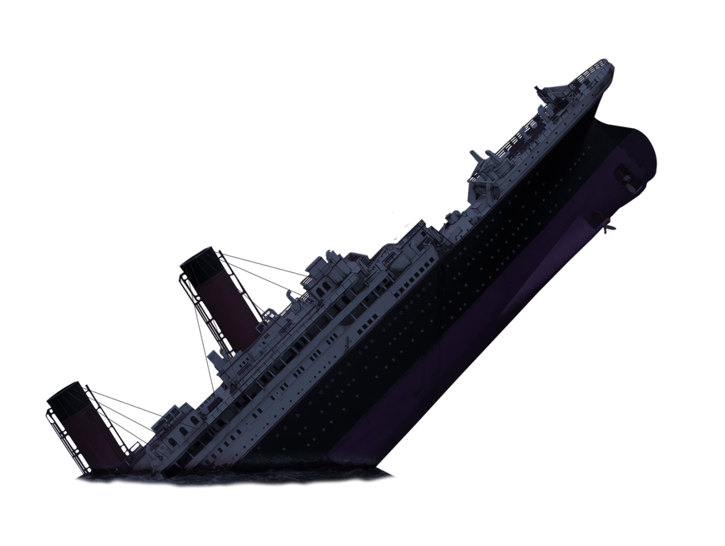

# All the Markdown Stuff we know already

## Links
::: {style="background: rgba(0,0,0,0.8); padding: 20px; border-radius: 15px;"}

```md
- This is a [Link](https://en.wikipedia.org/wiki/Special:Random)
- This is a [Ref](#all-the-markdown-stuff-we-know-already)
- This is a footnote [^ref].

[^ref]: This is the footnote text (this works in most flavours).
```
:::
&nbsp;
<!-- This is a HTML ecoded non-breaking space, as markdown and pandoc omit new-lines & spaces -->

::: {style="background: rgba(0,0,0,0.8); padding: 20px; border-radius: 15px;"}

- This is a [Link](https://en.wikipedia.org/wiki/Special:Random)
- This is a [Ref](#all-the-markdown-stuff-we-know-already)
- This is a footnote [^ref].
:::
[^ref]: This is the footnote text.


## Comments
:::::::::::::: {.columns}
::: {.column style="background: rgba(0,0,0,0.8); padding: 20px; border-radius: 15px;"}  
```md
This is normal text

[This is a Link comment]: #
<!-- This is a HTML Comment -->
```
:::
::: {.column style="background: rgba(0,0,0,0.8); padding: 20px; border-radius: 15px;"}  
This is normal text

[This is a Link comment]: #
<!-- This is a HTML Comment -->
:::
::::::::::::::


## HTML Shenanigans
::: {style="background: rgba(0,0,0,0.8); padding: 20px; border-radius: 15px;"}

- `<sub>` for <sub>Subtext</sub>
- `<sup>` for <sup>Supertext</sup>
- `<ins>` for <ins>Underline</ins>
- `<center>` to center text horizontally
- `<font color="red">` for <font color="red"> colored text (red)</font>
  (techn. deprecated, `<p style="color:red;">` for text effects)
- `&nbsp` HMTL escaped [entities](https://www.w3schools.com/html/html_entities.asp) and [symbols](https://www.w3schools.com/html/html_symbols.asp)
  (i.e. non-breaking space to force spaces into text for indents)[^w3]
- `` to control image size etc.
:::

[^w3]: Lists by [W3 schools](https://www.w3schools.com/)([HTML entities](https://www.w3schools.com/html/html_entities.asp), [HTML symbols](https://www.w3schools.com/html/html_symbols.asp))

## HTML Tricks
::: {style="background: rgba(0,0,0,0.8); padding: 20px; border-radius: 15px;"}

- `<kbd>` to symbolize keypresses
- Dropdowns:
  ```md
  <details>
  <summary>Click Here to Expand!</summary>
  Press <kbd>&darr;</kbd> to dive.
  [^subSource]
  </details>
  ```
:::
&nbsp;
<!-- This is a HTML ecoded non-breaking space, as markdown and pandoc omit new-lines & spaces -->

::: {style="background: rgba(0,0,0,0.8); padding: 20px; border-radius: 15px;"}

<details>
<summary>Click Here to Expand!</summary>
Press <kbd>&darr;</kbd> to dive.
[^subSource]
</details>
:::

[^subSource]: Yellow Submarine by [Carol Liao/toicon.com](Carol Liao/toicon.com) via [Wikimedia Commons](https://commons.wikimedia.org/wiki/File:Toicon-icon-fandom-submerge.svg)

## Math
:::::::::::::: {.columns}
::: {.column style="background: rgba(0,0,0,0.8); padding: 20px; border-radius: 15px;"}  
- `$...$` or ``` $`...`$ ``` for inline math
- `$$ ... $$` or ```` ```math ... ``` ```` for blocks
:::
::: {.column style="background: rgba(0,0,0,0.8); padding: 20px; border-radius: 15px;"}  
- Inline math like $(\frac{\pi}{2})$ is inline...
- Blocks are centered:
$$
   a^2+b^2=c^2
$$
:::
::::::::::::::


## [Stuff for Issues](https://gitlab.dlr.de/zeum_mo/sqw-2024/-/issues/10)
::: {style="background: rgba(0,0,0,0.8); padding: 20px; border-radius: 15px;"}

- Task Lists with `- [ ] ...`
   - `[x]` for checked and `[ ]` for unchecked tasks
   - (GitLab) `[~]` for canceled tasks (strikethru)
- References to issues with `#<issueNr>`
   - (GitLab) add `+` or `+s` for additional infos
- Use keywords to close issues
   - e.g. `fix`, `close`, `resolve`
- Custom diffs ```` ```diff ````
   - (GitLab) create inline diffs with `{- text -}`
:::


## Special Quotes
::::: incremental
::: {style="background: rgba(0,0,0,0.8); padding: 20px; border-radius: 15px;"}

- Emotes (e.g. [gitmoji.dev](https://gitmoji.dev/))
- ([GitHub](https://github.com/NXXR/MD-Iceberg-Talk/blob/07ad624629f745a5046fea1cc19bb3b458cbee49/examples/FlavouredQuotes.md)) flavoured Quotes ([!NOTE], [!TIP], [!IMPORTANT], [!WARNING], [!CAUTION])
   - **Alternative:** custom quotes using emotes  
     `> :bulb: **Tip**  `
:::
:::::


## Mermaid
<span style='font-size:3em;'>[&#129500;](https://github.com/NXXR/MD-Iceberg-Talk/blob/07ad624629f745a5046fea1cc19bb3b458cbee49/examples/mermaid.md)</span>


## GitLab Only Stuff
::: {style="background: rgba(0,0,0,0.8); padding: 20px; border-radius: 15px;"}  

[`[[_TOC_]]` or `[TOC]` to generate a Table of Contents automatically](https://gitlab.dlr.de/zeum_mo/sqw-2024/-/blob/main/README.md?plain=1#L3)
:::


## GitHub Only Stuff
::: {style="background: rgba(0,0,0,0.8); padding: 20px; border-radius: 15px;"}

:::::::::::::: {.columns}
::: {.column}  
[geoJSON, TopoJSON](https://github.com/NXXR/MD-Iceberg-Talk/blob/07ad624629f745a5046fea1cc19bb3b458cbee49/examples/TopoJSON.md)

<span style='font-size:3em;'>&#127757;</span>
:::
::: {.column}  
[STL 3D](https://github.com/NXXR/MD-Iceberg-Talk/blob/07ad624629f745a5046fea1cc19bb3b458cbee49/examples/STL.md)

<span style='font-size:3em;'>&#129482;</span>
:::
::::::::::::::
:::


## Thank!
::: {style="background: rgba(0,0,0,0.8); padding: 20px; border-radius: 15px; font-size:0.5em;"}

This presentation was generated with [`pandoc`](https://pandoc.org/) and [`revealjs`](https://revealjs.com/) from a `markdown` document![^titanic] [^pandocCMD]  
[It can be found here (Github/NXXR/MD-Iceberg-Talk).](https://github.com/NXXR/MD-Iceberg-Talk)
:::
{.absolute bottom=0}


[^titanic]: Titanic image edited from [source by pngarts.com](https://www.pngarts.com/files/5/Sinking-Titanic-PNG-Transparent-Image.png)

[^pandocCMD]: Slides generated with:
```bash
pandoc `
--from=markdown+backtick_code_blocks+fenced_code_attributes+fenced_divs+tex_math_dollars+footnotes `
-t revealjs `
-s 'readme.md' -o 'index.html' `
--embed-resources --standalone `
--mathml
```
